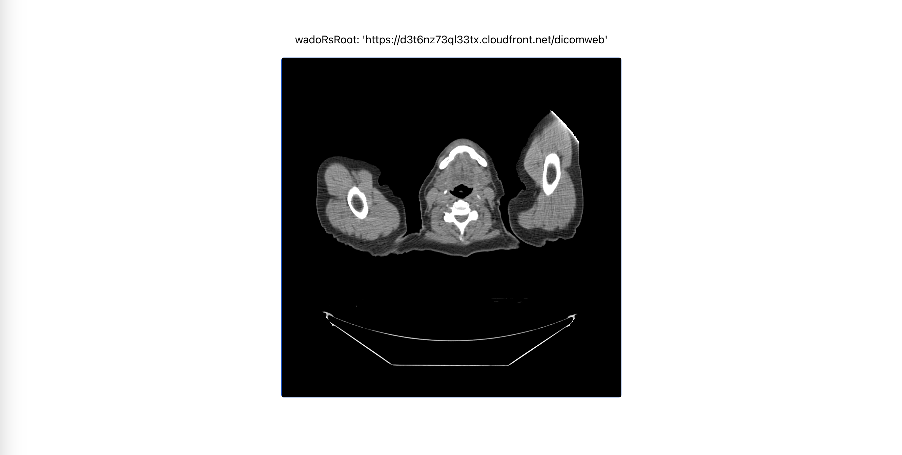

# Cornerstone.js React Example
Based off of a create-react-app template.



### Run the app

```
npm install
```
```
npm start
```

Runs the app in the development mode. Open [http://localhost:3000](http://localhost:3000) to view it in the browser.

### Cornerstone helpers
The functions in cornerstone3D-helpers were ported from /utils/demo/helpers in the [cornerstone3D](https://github.com/cornerstonejs/cornerstone3D/) repo.